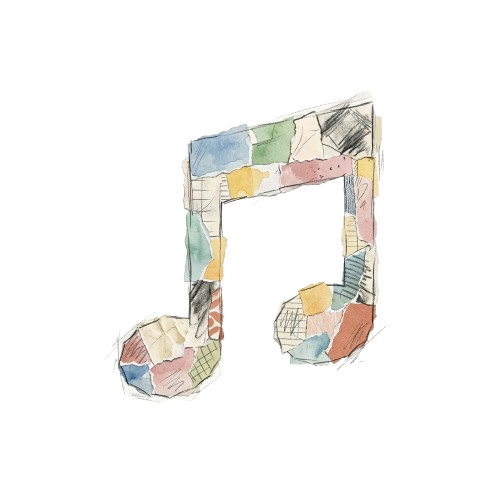

  
  <h1>Mosaic</h1>

## Overview
Mosaic is a music application designed with a unique sketchbook and paper-themed aesthetic. It provides a tactile, hand-drawn user experience that combines artistic design with modern functionality. The application features a dynamic theme engine supporting both light and dark modes, persistent user profiles, and a streamlined dashboard for content discovery.

## Core Features
- Sketchbook UI: A custom design system built with a paper and pencil aesthetic.
- Dynamic Theming: Real-time switching between light and dark modes with persistent state.
- Authentication: Secure user registration and login integrated with Firebase.
- Profile Management: Customizable user settings and appearance controls.
- Responsive Navigation: A fluid sidebar and stack-based navigation system.

## Technology Stack

### Frontend
- React Native: Core framework for cross-platform mobile development.
- Expo: Development platform and build pipeline.
- Zustand: Lightweight state management for authentication and theme persistence.
- React Navigation: Type-safe navigation across the application.
- Lucide React Native: Clean, consistent iconography.
- Axios: Promise-based HTTP client for API communication.

### Backend
- ASP.NET Core: High-performance web API framework.
- Firebase: Managed service for authentication and cloud storage.
- C#: Primary programming language for backend logic and service architecture.

## Design Philosophy
Mosaic prioritizes visual excellence and user engagement through micro-animations, hand-drawn components, and a curated color palette that avoids harsh digital tones in favor of soft, paper-like textures.
